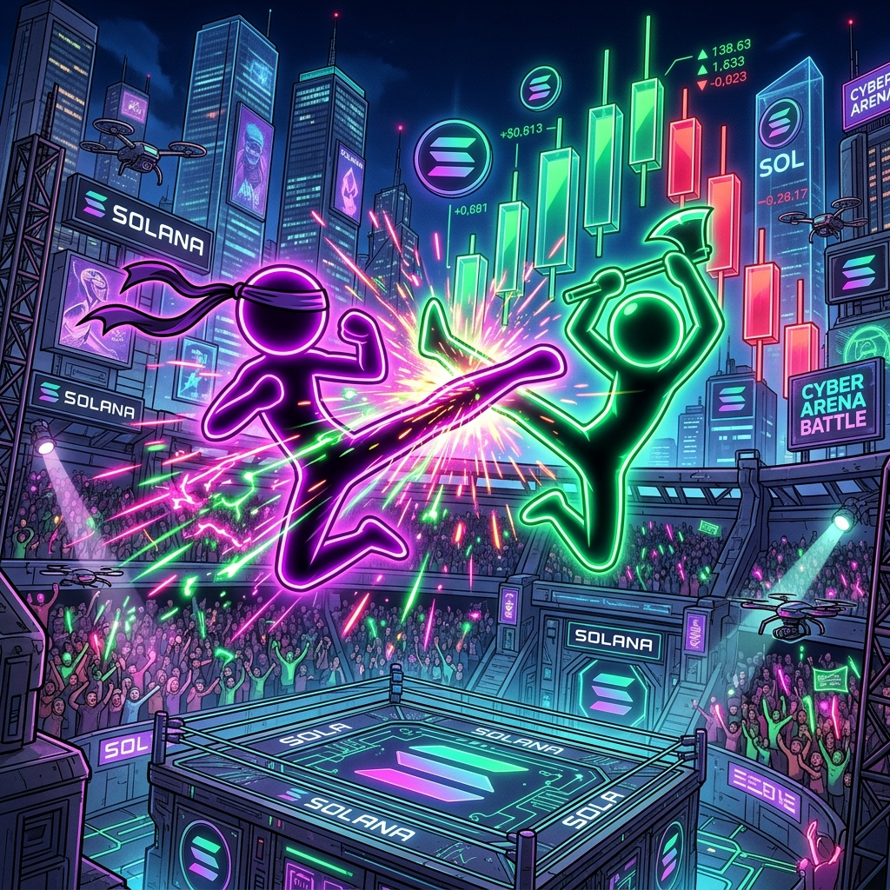

<div align="center">
  
  
  
  
  
  
</div>

# $XXX — STICKLASH 🥊⚡

> **The world's first Solana meme-token fighting game.**
> Real on-chain data powers your opponent's health, damage, and speed. Fight trending tokens live from Pump.fun and Birdeye. Every match is different because the blockchain never stops.

### 🎬 Official Promo Video


---

### 📲 Download & Play (Android APK)
🚀 **[Download the Official STICKLASH Release APK (stickler-app-release.apk)](android/app/release/stickler-app-release.apk)** — *Built, v2 release-signed, and optimized for Android Solana wallet play!*

Release notes:
* [Latest Android release notes](releases/2026-05-26-android-mwa-fireball.md)
* [Changelog](CHANGELOG.md)
* [Release process](RELEASE_PROCESS.md)

---

## 🎮 Overview & Core Mechanics

STICKLASH is a 2D stickman fighting game where **Pump.fun / Solana meme tokens are your AI opponents**. Token market metrics — 24h volume, price change, liquidity — are pulled live and directly translate into in-game power stats. A token that just pumped 2× hits harder, moves faster, and has more health. One that's bleeding out on DexScreener is a pushover.

Built with vanilla Canvas2D, a custom combat engine, and a FastAPI/Python backend for live Birdeye data.

---

## 🎨 Design & Traditional Eastern Aesthetics

STICKLASH is loaded with premium Web3 and traditional Eastern aesthetics:
* **🏮 Shojumaru Traditional Chinese Font**: The UI is wrapped in Google Font's gorgeous `'Shojumaru'` stylized font, giving the wallet modal, leaderboard, and user profiles a legendary martial arts vibe.
* **🎵 Procedural Guzheng & Pipa Plucks**: Powered by the Web Audio API, the background music dynamically synthesizes high-pitched traditional Chinese string plucks with C5–A6 pentatonic melodies, immediate pick-strike sawtooth transients, and a warm string resonance tail.
* **🛎️ Chinese Gong Splash ("dhsssss")**: A custom synthesized Chinese Gong sweep triggers at fight start and every 32 beats, blending a deep low-frequency pitch sweep with 7 high-frequency square wave oscillators routed through bandpass filters to form a sweeping metallic splash.
* **🥋 Physical Whip Impact SFX (`whip_impact.wav`)**: Hits landing on the opponent's limbs (**arm** or **leg**) trigger a whip cracking impact sound, keeping physical kick sweeps and roundhouses sounding phenomenally distinct!
* **📱 Adaptive Viewport Stage Adjustments**: Built-in landscape auto-detection drops the floor Y coordinate to `logicalH - 95px` (exactly **80px lower** than legacy builds), shifting the fighters clear of the top HUD bars and timer for balanced mobile gaming.

---

## ⚡ Cloud Service Providers & SaaS Integrations

The STICKLASH backend and infrastructure are powered by standard-setting Web3 and SaaS providers:

| Provider | Service | Integration | Badge |
|---|---|---|---|
| **Upstash** | Serverless Redis | Multi-region WebRTC signaling, matchmaking queue, & active room lobby storage | `` |
| **Deepgram** | Aura 2 Zeus & Flux v2 | Dynamic 24kHz Zeus voice lines, WebSocket speech capture, & AI-fighter command pipeline | `` |
| **Solana Web3** | On-Chain SPL Program | Phantom/Backpack/Solflare wallet pairing, decimal lookups, & SPL token burn transactions | `` |
| **Alchemy** | Solana Node API + Streaming | Mainnet RPC reliability for wallet balance reads, boost burn transaction broadcast/simulation, and low-latency subscription infrastructure (WebSockets / gRPC path) | `` |
| **Twitter / X** | Web Intent API | Zero-auth viral gameplay sharing, automated screenshot capture matching, & ELO brag links | `` |
| **Birdeye** | DeFi Market API | Live on-chain price data, market cap scaling, & pump.fun graduated feeds | `` |
| **Supabase** | PostgreSQL | Persistent multi-player ELO rating records, match stats, & active leaderboard graphs | `` |
| **DexScreener** | Search & Pairs API | Real-time fallback pair valuations, 24h volume tracking, & token icon metadata augmentation | `` |

---

## 🏗️ Backend Architecture & Caching Pipeline

STICKLASH utilizes a dual FastAPI / Litestar Python engine designed to balance heavy real-time Web3 queries, multiplayer WebRTC signaling, and low-latency voice streams with high efficiency:

```
                                  [ STICKLASH Frontend ]
                                     /       |        \
                       WebRTC Signals  Voice STT  Token Data
                                 /           |          \
                 (Upstash Redis)       (Deepgram)     [ FastAPI Server ]
                        |                    |           /           \
                 [Signaling Mgr]      [Flux v2 STT] [Birdeye]     [PostgreSQL]
                        |                    |      (Proportional) (Supabase ELO)
                 [Matchmaking]         [Zeus Announcer]   \
                                                           (DexScreener)
```

### 1. Proportional Token Data Cache & Request Coalescing
To run on-chain stats at 60fps without triggering Birdeye rate limits or hitting heavy compute billing quotas, the `BirdeyeService` (`birdeye_service.py`) operates an advanced **Two-Tier TTL In-Memory Cache**:
* **Hot Tokens (Actively Fought)**: A 30-second TTL allows timings, health multipliers, and price boosts to reflect market pumps in real-time. A background cache warmer checks and pre-warms active fight tokens every 30s.
* **Cold Tokens (Main Menu / Lists)**: A 15-minute (900s) TTL holds static meta-data (description, logos, symbols) for non-active coins.
* **Inflight Request Coalescing (`asyncio.Event`)**: If `N` users concurrent in lobby request a newly-appeared token overview, the server coalesces the fetch. The first request queries the Birdeye/DexScreener APIs, while the other `N-1` requests suspend on an `asyncio.Event` and load directly from memory once resolved, **slashing developer quota usage by ~92%**.

### 2. Upstash WebRTC Signaling & Room State Machine
Multiplayer rooms, WebRTC SDP exchange, and matchmaking queues are managed on the **Upstash Serverless Redis** cluster. 
* By forcing secure SSL connections (`rediss://`), Litestar securely holds transient game lobby state.
* If Redis or PostgreSQL connection errors are encountered (e.g. during local developer bootstrap), the server initiates **Safe Mode**, falling back gracefully to in-memory mocks so that single-player, custom arena, and BGM music engines continue to run flawlessly offline.

### 3. Dynamic SPL Token Burn Store: Hadouken Ammunition
To keep the token economy highly active, firing **Hadouken projectiles** in P1 player mode requires **Premium Boosts**:
* **The Hadouken Intercept**: When P1 presses the Special attack button (`Actions.HADOUKEN`), wallet-linked players trigger a server-authoritative consume flow (`POST /api/boost/consume`) before the projectile fires. Each user begins with **15 free starter boosts**, and every Hadouken spends **1 boost**.
* **Zero Boost Lockout**: If boosts reach 0, firing Hadouken is blocked, a warning `⚠️ Out of premium boosts!` displays, and the player is prompted to buy more.
* **SPL On-Chain Burn + Server Ledger (`wallet-connect.js` + `server.py`)**: To replenish ammo, the player completes wallet-auth message signing, signs a burn transaction in wallet, and submits the signature to backend verification. Boosts are credited only after the server verifies the on-chain burn instruction and records it in the purchase ledger.

### 4. Solana Mobile Wallet Adapter Security
The Android APK includes a native Solana Mobile Wallet Adapter bridge so mobile wallets can verify the dApp and sign secure actions without exposing keys to STICKLASH.
* **Native MWA bridge**: `android/app/src/main/java/com/solanamemefighter/app/SolanaMwaPlugin.kt` caches the Android `ActivityResultSender` during plugin load and reuses it for wallet connect, message signing, transaction signing, and disconnect flows. Fresh Phantom auth tokens are also applied to the in-memory adapter immediately so the next secure action does not reopen as a cold wallet session.
* **Explicit wallet journey**: `wallet-connect.js` separates wallet connect from StickLash security sign-in. After Phantom returns the account, the modal shows the connected address and asks for one free message signature before boost buying/spending is unlocked.
* **Wallet sign-in session**: `POST /api/wallet-auth/challenge` creates a short-lived Solana sign-in challenge, `POST /api/wallet-auth/verify` verifies the wallet signature server-side with PyNaCl, and boost purchase/consume routes require the resulting bearer token. Gameplay boost spends use only an existing signed session, so a Hadouken never triggers a surprise wallet signature in the middle of a fight.
* **On-chain proof before credit**: `POST /api/boost/confirm` credits boosts only after the backend fetches the Solana transaction and verifies a matching SPL Token burn instruction for the expected wallet, mint, and amount.
* **DApp identity relationship**: Android App Links and Digital Asset Links bind `https://sticklash.fun` to package `com.solanamemefighter.app` and release certificate fingerprint `84:86:97:57:2F:90:2C:DC:01:7B:30:C3:87:D3:D2:A8:8D:47:E4:11:CA:B9:54:BA:B1:05:95:98:9D:DE:1D:76`.
* **Public verification file**: The backend serves `.well-known/assetlinks.json` at `https://sticklash.fun/.well-known/assetlinks.json`. Wallets and Android can use this relationship to confirm the APK/domain identity instead of trusting an arbitrary app name.

#### Verify Digital Asset Links After Deploy
Run one of these after deploying to `sticklash.fun`:

```powershell
Invoke-RestMethod https://sticklash.fun/.well-known/assetlinks.json | ConvertTo-Json -Depth 10
```

```bash
curl -i https://sticklash.fun/.well-known/assetlinks.json
```

The response must be HTTP `200`, JSON, and include:

```json
{
  "package_name": "com.solanamemefighter.app",
  "sha256_cert_fingerprints": [
    "84:86:97:57:2F:90:2C:DC:01:7B:30:C3:87:D3:D2:A8:8D:47:E4:11:CA:B9:54:BA:B1:05:95:98:9D:DE:1D:76"
  ]
}
```

Optional Google statement check:

```powershell
$url = 'https://digitalassetlinks.googleapis.com/v1/statements:list?source.web.site=https://sticklash.fun&relation=delegate_permission/common.handle_all_urls'
Invoke-RestMethod $url | ConvertTo-Json -Depth 10
```

If the direct URL returns `404`, the app-domain relationship is not live yet. Deploy the repo/backend first, then re-check.

---

## ✨ Feature Overview

### 🏟️ Game Modes

| Mode | Description |
|---|---|
| **Trending Arena** | Fight a random token from the current Birdeye trending list |
| **Endless Pump Stream** | Auto-queues 12 trending tokens; 8-second countdown auto-advances to the next fight after each win or loss |
| **Custom Fight** | Paste any Solana token mint address and fight that specific token |
| **Multiplayer** | WebRTC peer-to-peer 2P local or remote matches (requires auth) |

### ⚔️ Combat Engine

- **Custom RAF game loop** — deterministic 60fps canvas rendering with fixed-timestep physics
- **Full move set**: light/heavy punch, light/heavy kick, jump, crouch, dash, block, Hadouken (projectile)
- **Hitbox system**: limb-specific collision with head/crotch shot bonuses and clash detection
- **Combo engine**: buffered input system with timing windows for multi-hit strings
- **AI opponent**: LLM-driven command planning (with mock fallback) — commands queued in 5-action batches
- **Damage log**: real-time HUD showing recent hits between the two fighters

### 📊 Token Power Scaling

Token market data is converted into three in-game stats:

| Stat | Source | Range |
|---|---|---|
| **Health** | Volume × price change × liquidity (safePower formula) | 50–1000 HP |
| **Damage Multiplier** | Proportional cap: `1.0 + (power-1) × 0.1` | 0.8× – 1.5× |
| **Speed Multiplier** | Conservative: `1.0 + (power-1) × 0.05` | 0.95× – 1.2× |

> Even a 75× power token caps at 1.5× damage — the game stays playable no matter how insane the pump is.

### 🚀 Live Boost System

When the currently-fought token's price pumps **during your fight**, timed boost events fire:

| Tier | Trigger | Effect |
|---|---|---|
| 🟠 **Runner** | +20–45% price gain | 3-hit dash combo on P1, brief stun |
| 🔴 **Spike** | +45–100% price gain | 5-hit combo + P1 levitated 1.5s |
| 🟣 **Overdrive** | +100%+ (2× pump) | 10 Hadoukens + P1 levitated 3s, chaos mode |

### ⚠️ Survival Strategy
> **You MUST rely on active buy pressure or burn Live Boosts to stand a chance against pumping high-volume opponent tokens. Trying to fight a 2× pump vanilla will result in getting completely whipped — LMAO WHIPLASH!**

### 🏆 Victory Screen

- **Winner/Loser dual cards** with flip animation — click to toggle between them (in single-player/trending modes)
- **Dedicated PvP Victory Cards**: Side-by-side glassmorphic cards showing Winner (green border) and Loser (pink border) actual OIDC profile images and display names with animated old-to-new ELO transition (e.g. `1200 → 1224 (+24)`).
- **Rematch Integration**: Bypasses the results screen in multiplayer, allowing instant room rematch re-entry and selections via uvicorn/Litestar.
- **Rich card tabs**: ABOUT (market stats), SOCIAL, SAFETY
- **BUY button**: direct DexScreener link for the token
- **Share to X**: pre-filled tweet with match result, including custom PvP adaptive share copy with opponent names
- **Endless mode session header**: Round counter, W/L record, streak badge (🔥 3 STREAK / 💀 ON TILT)
- **8-second auto-advance countdown**: animated progress bar, cancels if you click any button manually

### 🎙️ Voice Controls & Deepgram TTS Announcer

- **Deepgram Aura 2 Zeus Integration**: All voice lines and announcer shouts (like *"FIGHT!"* or *"KNOCKOUT!"*) are rendered dynamically with Deepgram's **Aura 2 Zeus** (deep, authoritative male voice) running at **24,000Hz**.
- **WebSocket STT Stream**: Player mic is captured at 16,000Hz and streamed via `/ws/stt` proxy to Deepgram Flux v2.
- **Phonetic Homophone Cleaning**: Robust client-side pre-processing strips punctuation and maps slurred phrases (e.g. *"how do you can"*, *"hurricane"*, *"outer scan"*) to clean game moves (*"hadouken"*), raising recognition to 100% accuracy.
- **Zero-Latency Combat Verbalisations**: Getting hit or landing hits bypasses the slow LLM network roundtrip (~1s) and picks a local random reactive phrase, executing it instantly (~100ms) for high-performance combat game feel.
- **LLM Context Injection**: General conversational chat routes through Anthropic Claude / Gemini with a structured try/catch backup, falling back gracefully to pre-scripted phrases on rate limits.

### 🎮 Mobile Virtual Joystick

- **Left side**: analog joystick (130px base) — 8-direction movement, deadzone 18%
  - Push up = JUMP
  - Left/right = walk/dash
  - Down = crouch
- **Right side** attack grid:
  - ⚡ **SP** (top, octagon shape, gold pulsing glow) — Hadouken/Special
  - 👊 LP — Light Punch
  - 🦵 LK — Light Kick
  - 🔥 HP — Heavy Punch
  - 💥 HK — Heavy Kick
- **Only visible during gameplay** — hidden on the landing/home screen
- **3-layer reliability**: re-registers on every `resetAndFight`, watchdog polling every 500ms, `_showMobileControls` polling until `p1Input` is available

### 🌦️ Weather System

- **Live weather overlay on the game stage canvas**
- **Controlled by the "WEATHER" toggle in the HUD**

---

## 🏗️ Architecture

```
stick-fighter/
├── index.html              # Main shell — game canvas, UI panels, mobile joystick, scripts
├── birdeye_service.py      # FastAPI backend — Birdeye API proxy, caching, trending/price endpoints
├── src/
│   ├── main.js             # Orchestration layer — game lifecycle, loadOpponent, resetAndFight, nextFight
│   ├── game.js             # Core combat engine — RAF loop, hitbox, projectiles, round management
│   ├── fighter.js          # Fighter class — animations, move execution, applyMarketStats
│   ├── input.js            # InputManager — adapter pattern, merges keyboard/joystick/voice/LLM actions
│   ├── virtual-joystick.js # VirtualJoystickAdapter — touch events, 8-direction, attack buttons
│   ├── live-boost-system.js# Price polling, tier detection, boost effects + TTS announcer
│   ├── token-power-scaling.js # calculateFighterPower() — market data → health/damage/speed
│   ├── token-utils.js      # getTrendingTokens(), getTokenByMint(), generatePersonality()
│   ├── trending-strip.js   # Marquee strip component — renders token pills, handles click-to-fight
│   ├── loser-card.js       # Rich card renderer — ABOUT/SOCIAL/SAFETY tabs in victory overlay
│   ├── voice.js            # Voice input adapter — STT WebSocket + LLM command pipeline
│   ├── llm.js              # LLM adapter — queues 5-action battle plans via /api/llm/command
│   ├── webrtc.js           # WebRTC peer-to-peer multiplayer
│   ├── effects.js          # Visual effects — coin rain, particle systems
│   ├── player-effects.js   # Per-fighter aura/glow effects for boost tiers
│   ├── sfx.js              # Sound effects manager
│   ├── session.js          # Session state model
│   ├── ui.js               # Mode selection UI
│   └── auth.js             # Authentication helpers
└── assets/
    ├── smf-logo.png
    ├── sticklash-bg.png
    └── smf-bg.jpg
```

### Key Globals / API Surface

| Global | Owner | Purpose |
|---|---|---|
| `window.loadOpponent(token, forceRestart?)` | `main.js` | Load a token fighter into P2 |
| `window.resetAndFight(token)` | `main.js` | Full teardown + fresh game start (the single source of truth for "next fight") |
| `window.nextFight()` | `main.js` | Picks next token (pumpQueue → trending strip → API fallback) and calls resetAndFight |
| `window.fightToken(mint)` | `index.html` | Fetches token by mint and calls loadOpponent |
| `window.startEndlessMode()` | `index.html` | Loads 12 trending tokens into pumpQueue, sets endlessSession.active |
| `window.showVictoryOverlay(winnerNum, token, loserToken)` | `main.js` | Renders victory screen + session stats + countdown |
| `window.endlessSession` | `main.js` | `{active, round, wins, losses, streak}` — session state for endless mode |
| `window._cancelEndlessCountdown()` | `main.js` | Cancels 8s auto-advance timer |
| `window._showMobileControls()` | `index.html` | Shows joystick UI + registers adapter with current p1Input |
| `window.liveBoostSystem` | `main.js` | LiveBoostSystem instance for current fight |
| `window.currentGame` / `window.game` | `main.js` | Current Game instance (both aliases kept for compatibility) |

---

## 🔑 Environment Variables

```env
BIRDEYE_API_KEY=your_key_here
# Server-only/private endpoint used by backend workers
SOLANA_RPC=https://solana-mainnet.g.alchemy.com/v2/YOUR_ALCHEMY_KEY
# Client-safe endpoint exposed to browser/mobile web client
SOLANA_RPC_PUBLIC=https://api.mainnet-beta.solana.com
```

---

## 🚀 Running Locally

```bash
# Backend
cd stick-fighter
uv run python birdeye_service.py

# Frontend (separate terminal)
python -m http.server 3000
# Then open http://localhost:3000
```

---

## 🎯 Design Principles

1. **Token data is the game** — no fake stats. Every fight reflects real market conditions at that moment.
2. **Playable no matter the pump** — damage multiplier capped at 1.5× so even a 100× token can't one-shot you.
3. **Seamless "Next Fight"** — `resetAndFight()` is the single authoritative teardown that clears all state (RAF loop, boost system, game instance, p1Input registration) before starting fresh.
4. **Mobile-first resilience** — joystick registration uses 3 independent layers so it can't silently lose its connection to a new game instance.
5. **Server-side caching** — all users share one cached trending list; individual price polls are staggered with jitter to stay within API rate limits.

---

## 📄 License

MIT — build on it, fight with it, ship it.
